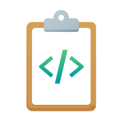

# snippets-cli (snip)

[](https://www.npmjs.com/package/@jtsternberg/snip)
[](https://github.com/jtsternberg/snippets-cli/releases/latest)
[](https://opensource.org/licenses/MIT)
[](https://nodejs.org)



CLI for your **snippet and prompt library**: code snippets, LLM prompts, and reusable content — with semantic search, Obsidian-compatible markdown storage, and LLM enrichment.

## What you can store

- 📋 **Code snippets** — boilerplate, helpers, and reference fragments (by language)
- 💬 **Prompt library** — system prompts, instruction templates, and AI prompts with `{{variable}}` placeholders; run with `snip run <name>` and pass variables at use time
- 🏷️ **Custom types** — add your own (e.g. `checklists`, `templates`, `agents`) via `snip config:types:add <name>`

## Features

- 📁 **Local-first markdown storage** — Obsidian-compatible, plain files you own
- 🔍 **Semantic search** via [qmd](https://github.com/tobilu/qmd) vector embeddings
- 🤖 **BYOL (Bring Your Own LLM)** — auto-generate title, description, tags, and language with your choice of Ollama, Gemini, Claude, or OpenAI
- 💬 **Prompt templates** — first-class `prompts/` type and `{{var}}` syntax; `snip run` fills variables
- ⌘ **Alfred workflow** integration for macOS
- ⚡ **Shell completions** for bash, zsh, and fish
- 📥 **Import** from files, globs, URLs, or GitHub Gists
- 📤 **Export** to JSON, Markdown, or GitHub Gists
- 🔄 **Gist sync** — bidirectional sync between local snippets and GitHub Gists

## Installation

```bash
npm install -g @jtsternberg/snip
```

Requires **Node.js 22+**.

### From source

```bash
git clone https://github.com/jtsternberg/snippets-cli.git
cd snippets-cli
npm install
npm run build
npm link
```
## Quick Start

```bash
snip init                          # Initialize library at ~/snippets
snip add --from-clipboard          # Add snippet from clipboard
snip add --type prompts --title "Code review" --lang prompt  # Add to prompt library
snip add --title "My Script" --lang bash  # Add with metadata
snip search "api helper"           # Semantic search
snip run my-prompt -- language=TypeScript  # Run prompt template with variables
snip copy my-snippet               # Copy to clipboard
snip show my-snippet               # Display in terminal
```

## Commands

| Command | Description |
| --- | --- |
| `snip init` | Initialize snippet library and config |
| `snip add` | Add a new snippet (interactive or scripted, `--provider`) |
| `snip show <name>` | Display snippet (`--raw`, `--code`) |
| `snip copy <name>` | Copy snippet to clipboard |
| `snip edit <name>` | Open snippet in editor |
| `snip rm <name>` | Delete a snippet |
| `snip list` | List snippets (`--type`, `--tag`, `--lang`, `--json`) |
| `snip tags` | List all tags |
| `snip search <query>` | Semantic search (`--json`, `-n`, `--mode`) |
| `snip find <query>` | Fuzzy text search |
| `snip rename <name> <new-name>` | Rename a snippet |
| `snip run <name>` | Fill template variables and copy result (`--var key=value`) |
| `snip exec <name> [args...]` | Execute a snippet as a script (`--shell`, `--dry-run`); positional args are passed to the script (use `--` before args starting with `-`) |
| `snip link <name>` | Create symlink to snippet |
| `snip import [sources...]` | Import from files, globs, URLs, or gists (`--from-gist`, `--provider`) |
| `snip export [name]` | Export to JSON, Markdown, or GitHub Gist (`--to-gist`, `--public`) |
| `snip enrich [name]` | Re-run LLM enrichment (`--all`, `--force`, `--dry-run`, `--provider`) |
| `snip sync` | Sync gist-linked snippets (`--push`, `--pull`, `--dry-run`) |
| `snip config` | View or set configuration |
| `snip config:types:add <name>` | Add a snippet type |
| `snip config:llm` | View LLM provider configuration |
| `snip config:llm:provider <name>` | Set primary LLM provider |
| `snip config:llm:fallback <name>` | Set fallback LLM provider |
| `snip config:llm:key <provider> <key>` | Set API key for a provider |
| `snip config:llm:model <provider> <model>` | Set model for a provider |
| `snip install <integration>` | Install integrations (completions, alfred, obsidian) |
| `snip upgrade` | Update snip and reinstall integrations |
| `snip doctor` | Health check |

## Configuration

Config file: `~/.config/snip/config.json`

| Setting | Description | Default |
| --- | --- | --- |
| `libraryPath` | Path to snippet library | `~/snippets` |
| `types` | Snippet type directories | `["snippets", "prompts"]` |
| `defaultType` | Default type for new snippets | — |
| `editor` | Editor for `snip edit` (falls back to `$EDITOR`) | — |
| `llm.provider` | LLM provider (`ollama`, `gemini`, `gemini-cli`, `claude`, `claude-cli`, `openai`, `openai-cli`, `auto`) | `"ollama"` |
| `llm.fallbackProvider` | Fallback provider (same options, or `null`) | `null` |
| `llm.ollamaModel` | Ollama model | `"qwen2.5-coder:7b"` |
| `llm.ollamaHost` | Ollama API host | `"http://localhost:11434"` |
| `llm.geminiApiKey` | Gemini API key (or use `GEMINI_API_KEY` env var) | `null` |
| `llm.geminiModel` | Gemini API model | `"gemini-2.5-flash"` |
| `llm.geminiCliModel` | Gemini CLI model (when using `gemini-cli`) | `"gemini-2.5-flash"` |
| `llm.anthropicApiKey` | Anthropic API key (or use `ANTHROPIC_API_KEY` env var) | `null` |
| `llm.anthropicModel` | Claude API model | `"claude-3-5-haiku-latest"` |
| `llm.claudeCliModel` | Claude CLI model (when using `claude` CLI) | `"haiku"` |
| `llm.openaiApiKey` | OpenAI API key (or use `OPENAI_API_KEY` env var) | `null` |
| `llm.openaiModel` | OpenAI API model | `"gpt-4o-mini"` |
| `llm.codexCliModel` | OpenAI CLI model (when using `openai-cli`) | `"o4-mini"` |
| `qmd.collectionName` | qmd collection name | — |
| `alfred.maxResults` | Max Alfred results | — |

### Environment Variables

- `SNIP_LIBRARY` — Override library path
- `EDITOR` — Fallback editor
- `GEMINI_API_KEY` — Gemini API key (overrides config)
- `ANTHROPIC_API_KEY` — Anthropic/Claude API key (overrides config)
- `OPENAI_API_KEY` — OpenAI API key (overrides config)

## Snippet Format

Snippets are stored as markdown files with YAML frontmatter:

```markdown
---
title: API Request Helper
description: Fetch wrapper with error handling
tags:
  - javascript
  - api
aliases:
  - fetch-helper
language: javascript
type: snippets
date: "2026-03-09"
modified: "2026-03-09"
source: ""
related:
  - "[[error-handling]]"
---

```javascript
async function apiRequest(url, options = {}) {
  const response = await fetch(url, options);
  if (!response.ok) throw new Error(`HTTP ${response.status}`);
  return response.json();
}
```
```

The `related` field uses Obsidian-style wikilinks for cross-referencing. For prompts, set `type: prompts`, use `language: prompt` and optional `{{variable}}` placeholders in the body; use `snip run <name> -- var=value` to fill and run them.

## Integrations

### Alfred Workflow

```bash
snip install alfred
```

- **`snip` keyword** — search snippets
- **Enter** — paste snippet
- **Cmd+Enter** — copy to clipboard
- **Alt+Enter** — open file
- **Ctrl+Enter** — reveal in Finder
- **`snipsaveclipboard` keyword** — save clipboard as a new snippet

### Shell Completions

```bash
snip install completions        # Auto-detect shell
snip install completions zsh    # Specific shell
```

### Obsidian

```bash
snip install obsidian
```

Opens your snippet library as an Obsidian vault. Snippets use wikilinks in `related` fields for cross-referencing.

### GitHub Gist Sync

Export snippets as GitHub Gists and keep them in sync. Requires the [GitHub CLI](https://cli.github.com) (`gh`).

```bash
snip export my-snippet --to-gist          # Create a secret gist
snip export my-snippet --to-gist --public # Create a public gist
snip export my-snippet --to-gist          # Re-run to update existing gist
snip import --from-gist <gist-url-or-id>  # Import all files from a gist
snip sync                                 # Sync all gist-linked snippets
snip sync --dry-run                       # Preview what would sync
snip sync --push                          # Force push local changes
snip sync --pull                          # Force pull gist changes
```

Gist-linked snippets track their `gist_id` and `gist_updated` timestamp in frontmatter for automatic sync detection.

### Semantic Search (qmd)

Install [qmd](https://github.com/tobilu/qmd) for semantic/vector search:

```bash
npm i -g @tobilu/qmd
```

### BYOL: Bring Your Own LLM

Snip uses an LLM to auto-generate metadata (title, description, tags, language, aliases) when you add or import snippets. Choose from four providers:

**Ollama** (default — local, free):
```bash
brew install ollama
ollama pull qwen2.5-coder:7b
```

**Gemini** (cloud):
```bash
snip config:llm:provider gemini
snip config:llm:key gemini YOUR_API_KEY
# or: export GEMINI_API_KEY=YOUR_API_KEY
```

**Claude** (cloud API or local CLI):
```bash
snip config:llm:provider claude
snip config:llm:key claude YOUR_API_KEY
# or: export ANTHROPIC_API_KEY=YOUR_API_KEY
# If no API key, falls back to the `claude` CLI if installed
```

**OpenAI** (cloud):
```bash
snip config:llm:provider openai
snip config:llm:key openai YOUR_API_KEY
# or: export OPENAI_API_KEY=YOUR_API_KEY
```

**Auto mode** — tries CLI tools first (gemini-cli, claude-cli, openai-cli), then Ollama, then cloud APIs (Gemini, Claude, OpenAI) until one succeeds:
```bash
snip config:llm:provider auto
```

Re-enrich existing snippets after switching providers:
```bash
snip enrich my-snippet          # Single snippet
snip enrich --all               # All snippets with missing metadata
snip enrich --all --force       # Regenerate all metadata
```

## Claude Code Plugin

This repository includes a [Claude Code plugin](claude-plugin/.claude-plugin/README.md) for AI-assisted snippet management. Add, search, and organize snippets using natural language.

### Quick Example

```
You: "Save this as a prompt in my prompt library"
You: "Save this function to my snippets with tags js and util"
You: "Find all my Python snippets about error handling"
You: "Run my code-review prompt template with language=TypeScript"
```

### Installation

In Claude Code:
```
/plugin marketplace add jtsternberg/snippets-cli
/plugin install snippets-cli
```

Or point to your existing copy of the snippets-cli repository:
```
/plugin marketplace add ./snippets-cli
/plugin install snippets-cli
```

### Features

- **Skills**: Auto-invoked when discussing snippets, code fragments, or prompt templates
- **Commands**: `/snippets-cli:add`, `/snippets-cli:find`, `/snippets-cli:show`
- **Agent**: Snippet specialist for complex multi-step workflows

See [claude-plugin/.claude-plugin/README.md](claude-plugin/.claude-plugin/README.md) for full documentation.
## Development

```bash
npm run dev          # Watch mode
npm test             # Run tests
npm run build        # Build for production
npm run typecheck    # Type checking
```

## License

MIT
